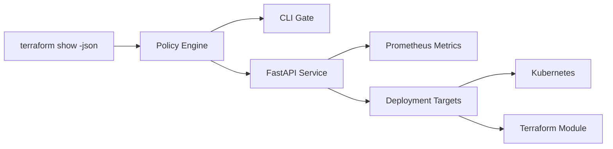

# Terraform Cost Policy Guard

`terraform-cost-policy-guard` is a production-shaped portfolio project for reviewing `terraform show -json` output before an infrastructure change reaches production. It combines a reusable policy engine, a FastAPI review service, a CLI for CI/CD pipelines, Prometheus metrics, container packaging, and deployment manifests.

## What It Demonstrates

- Terraform plan risk analysis for cost, destructive changes, tag hygiene, and public ingress
- Python service design that works both as an API and as a pipeline CLI
- Local test automation with `pytest`
- Container packaging plus Kubernetes and Terraform deployment scaffolding
- Basic observability through `/healthz`, `/metrics`, and structured evaluation output

## Architecture



## Repository Layout

```text
src/terraform_cost_policy_guard/   API, CLI, policy logic, models
tests/                            unit and API checks with plan fixtures
infra/docker/                     docker-compose example
infra/k8s/                        Kubernetes deployment and service
infra/terraform/                  Terraform skeleton for cluster deployment
docs/CASE_STUDY.md                recruiter-facing project narrative
docs/github-actions/ci.yml        CI workflow kept outside .github until workflow scope exists
```

## Policies Implemented

- `monthly-cost-threshold`: blocks plans above the configured monthly delta
- `protected-resource-delete`: blocks deletes for stateful resources such as RDS and S3
- `public-sensitive-port`: blocks public ingress to ports like `22`, `3306`, and `5432`
- `missing-required-tags`: flags resources missing tags such as `owner` and `environment`

## Quick Start

```bash
cd /Users/nagadeepakappalaneni/Documents/New\ project/showcase-repos/terraform-cost-policy-guard
make install
make test
make sample-eval
make run
```

## CLI Usage

```bash
PYTHONPATH=src tf-policy-guard tests/fixtures/risky_plan.json --monthly-cost-limit 500
```

The CLI prints JSON with:

- evaluation summary
- violation list
- blocking decision

## API Usage

Start the service:

```bash
make run
```

Evaluate a plan:

```bash
curl -X POST http://127.0.0.1:8080/evaluate \
  -H 'Content-Type: application/json' \
  -d @<(jq -n --slurpfile plan tests/fixtures/risky_plan.json '{plan: $plan[0], monthly_cost_limit: 500}')
```

Health and metrics:

```bash
curl http://127.0.0.1:8080/healthz
curl http://127.0.0.1:8080/metrics
```

## Docker

```bash
docker build -t terraform-cost-policy-guard:local .
docker run --rm -p 8080:8080 terraform-cost-policy-guard:local
```

An example compose file is included at `infra/docker/docker-compose.yml`.

## Deployment Notes

- `infra/k8s/deployment.yaml` deploys two replicas and exposes Prometheus scrape annotations.
- `infra/terraform/` shows one way to template the Kubernetes deployment from Terraform.
- `docs/github-actions/ci.yml` is ready to move into `.github/workflows/ci.yml` once the GitHub token has workflow scope.

Exact command to enable workflow pushes later:

```bash
gh auth refresh -h github.com -s workflow
```

## Verification

Commands verified locally in this run:

- `make install`
- `make test`
- `make sample-eval`
- `python -m uvicorn terraform_cost_policy_guard.main:app --host 127.0.0.1 --port 8080`
- `curl http://127.0.0.1:8080/healthz`
- `curl -X POST http://127.0.0.1:8080/evaluate ...`
- `docker build -t terraform-cost-policy-guard:local .`

## Limitations

- Cost estimation is fixture-driven and expects a monthly delta field in the plan JSON.
- Policies are intentionally small and easy to extend rather than tied to a full policy framework.
- Terraform deployment files are a starter skeleton and assume an existing Kubernetes provider configuration.
